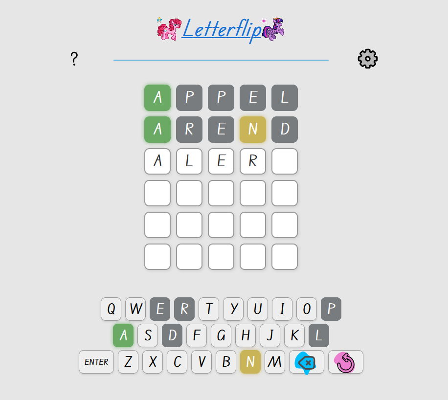

# Letterflip
A Wordle-style game with unique features. Similar concept, but different gameplay mechanics

***Letterflip*** is a Wordle-inspired game that introduces unique gameplay mechanics while keeping the core concept of word guessing intact. This version brings fresh features and strategic elements that offer a new challenge for players.

🧩 Key Features
A word guessing game with custom mechanics beyond the traditional five-letter format

New gameplay rules that require a different approach to deduction and strategy

Option to tweak rules and difficulty (word length customization is a planned feature)

Clean, responsive interface designed for an engaging user experience

🎯 Goal
Guess the hidden word within a limited number of tries, using feedback from each guess to refine your strategy. Unlike traditional Wordle, this version may include alternative hints, varied letter behavior, or dynamic rule sets.

